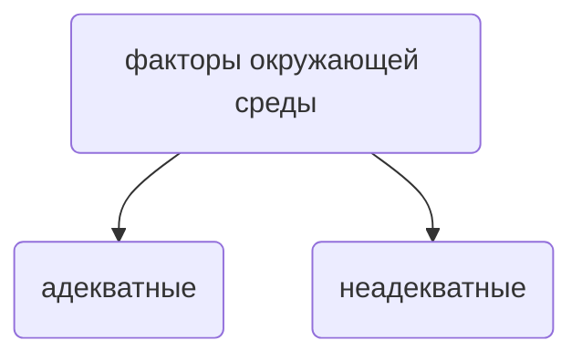
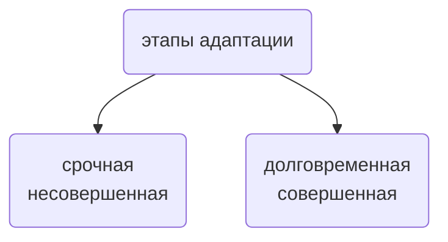
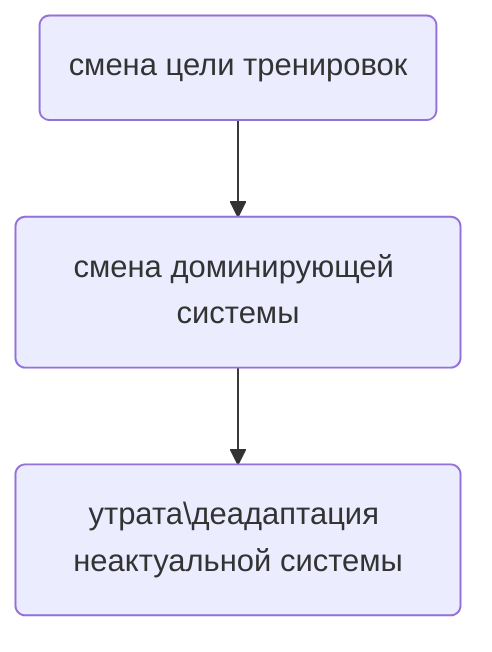

# Адаптация

Рождаясь, живой организм имеет комплекс средств, чтобы поддерживать в себе пламя жизни,
противостоя вызовам и испытаниям окружающей среды. Среды, которая необыкновенно
многообразна в своём проявлении. Как совладать с этим многобразием?
Ответ прост: иметь возможность к многообразию.
В распоряжение всякому живому организму отведена возможность измениться, приспособиться, **адаптироваться**.

<!--:::info ИНФОБЛОК
:nerd_face:

:timer_clock:
:::-->

<!--:::info ИНФОБЛОК
:nerd_face:

:timer_clock:
:::-->

## Рождённый ходить

> *Мне кажется, это естественное увлечение для людей. Я еще с детства хотел им заниматься.
> Естественные скалы - это единение природы и человека, новые ощущения.*
>
> – Алексей Рубцов

Естественным для человека назовём всё то, что не требует от него координальных изменений.
Тогда **насколько же лазание являетсва естественным** процессом для человеческого тела?

:::note ЗАМЕТКА!
Для стопы используются специфическая номеклатура движения сустава.
**"flexion"** переводится как **"сгибание"**, которое может быть тыльным (dorsiflexion) и
подошвенным (plantar flexion). Поэтому **за словосочетанием "разгибание стопы" скрывается, как правило,
тыльное сгибание**.

:::

Поскольку первичным для человека стало лазание по деревьям, имеет смысл
проанализировать человеческое тело в контексте именно этой разновидности лазания.

В таком виде лазания важно, чтобы голеностопный сустав **имел значительный угол тыльного сгибания**,
позволяющий приблизить центр масс ближе к дереву:

Всё ещё можно найти поселения людей, которые и по сей день занимаются собирательством. 
Например, племя Тва из Филлипин. Если измерить угол,
на который может сгибаться их голеностопный сустав, и сравнить его с обезьянами и обычными людьми, то получится
диаграмма следующего вида:

В самом низу диаграммы данные обычных людей, а собиратели из Филлипин хоть и превзошли
их, немного отстают от обезьян.

Главной причиной отставания можно считать различие в архитектуре большеберцовой кости
обезьян и человека:

трапецевидное углубление в кости обезьян увеличивает подвижность голеностопного сустава.
Кроме того, строение стопы обезьяны позволяет противопоставлять большой палец для
хватательного движения. 

Разница между человеком и обезьяной не ограничивается только лишь нижними конечностями.
Более плотная плечевая кость обезьяны лучше подходит для висов, чем человеческая.
Между тем, известно, что кости способны менять свою структуру согласно механической <!--link to site-->
нагрузке.

## Адаптология

### Факторы адаптации

Факторы окружающей среды можно разделить на две группы, согласно их адекватности:

под адекватными условиями понимаются такие условия, которые **соответствуют
свойствам организма** в данный момент его существования. Механизмы адаптации
к таким факторам формировались на протяжении длительного времени в процессе
эволюции и онтогенеза.

Неадекватные условия представляют из себя такие условия, которые вынуждают
организм прибегать к **дополнительным механизмам приспособления**.

Спортивное лазание включает в себя элементы лазания по деревьям и даже куда более сложные биомеханиечкие движения.
Соответственно **спортивное лазание предлагает человеку неадекватные условия**.
Но не только оно. Неадекватные условия окружающей среды - постоянный и главный спутник
человека на протяжении всей его жизни. **Пусть человек и не рождён, чтобы лазать, но он
не лишён возможности научиться этому**.

:::note ЗАМЕТКА!
Возвращаясь к лазанию по деревьям, можно сказать, что для современного человека
лазание по деревьям представляет из себя по большой части неадекватные условия,
поскольку вынуждают его активировать дополнительные механизмы. Например, чтобы
увеличить угол сгибания стопы, мышцы-сгибатели должны претерпеть ряд изменений,
которые не нужны обезьянам из-за архитектуры их большеберцовой кости.
:::

### Адаптация - функция времени

Адаптация - функция времени. Другими словами, адаптация определяется временем.
На отрезке этого времени можно отследить различные фазы, стадии и этапы.

В общем случае адаптацию можно разделить на два этапа:

> *"Основное содержание срочного этапа адаптации заключается в мобилизации энергетических и
> структурных ресурсов организма и дискриминативном их распределении в целях формирования
> функциональной системы, эффективно реагирующей 
> на действие неадекватного фактора среды и обеспечивающей специфическую (долговременную) адаптацию к нему. И то,
> и другое достигается посредством активации механизмов не­специфического приспособления — стресса."*

Из этого глубокомысленного предложения следует, что неадекватные условия среды
становятся причиной стресса, который сам по себе является скорее вынужденной мерой,
чем эффективной. Однако **впоследствии стресса организм обретает совершенные механизмы адаптации**.

### Адаптационный след и принцип доминанты

> Не идите по следам древних, но ищите то, что искали они
>
> - Мацу Басё

Фактор, действующий на человека во время тренировок, обращется в его глубины, в самую суть, в ядро клеток.
В ядре находится генетический код, в котором есть ответ на вопрос: "**Как и чем ответить на стрессовый фактор?**".
Ответ часто носит уникальный и избирательный характер, поэтому увеличивается функциональность только тех структур,
которые необходимы. Так формируется **системный структурный след**.

**Принцип доминанты** подразумевает, что активируется необходимая для конкретной адаптации система. Прочие системы
напротив, подвергаются **деадаптации**. Поэтому вместе с тем, как меняются цели и задачи тренировки, меняется и сам организм.
Ненужные системы атрофируются, нужные набирают обороты. **Нужна сверхсила - отключается сверхвыносливость** и наоборот.
Это проистекает из явления, называемого **смена доминант**

Схема того, каким образом "заметаются следы":

## Итог

- человеческое тело не вынуждено адаптироваться к лазанию, которое предъявляет для него большое количество
неадекватных факторов адаптации.

- тренировки - это не что иное, как целенаправленное воздействия на организм по большей части
неадекватных факторов адаптации.

- срочная адаптация, возникающая как реакция на стресс, оставляет следы и со временем перерастает в специфическую, долгосрочную
адаптацию, которая более совершенна.

- адаптация действуют по принципу доминанты, предполагающий переключение с одного механизма на другой, с "забыванием" первого.

### Приложение знаний

Понимание того, что лазание далеко не естественный процесс для человека, приводит к выводу:
**нужны адаптационные перестройки**, которые могут затягиваться во времени, - не спешите с этим.
Принцип доминант накладывает ограничения на возможность для **человека овладеть несколькими
механизмами адаптации** на предельном уровне. Расставляйте приоритеты.

### Вопросы для самоконтроля

 
  

		Что говорит в пользу того, что человек не создан для лазания по деревьям?
	

	  Строение большеберцовой кости, ограничивающей движение в голеностопном суставе
		по сравнению с обезьянами.

 
  

		На какие два этапа можно разделить процесс адаптации?
	

	  Срочная (неспецифическая) адаптация и долговременная (специфическая) адаптация

 
  

		Человек в бОльшей степени сталкивается с адекватными или неадекватными условиями
		окружающей среды?
	

	  Неадекватными.

## Дополнительно

### Эффект низкой базы

Положим, что новичок решил увеличить подтягивание с дополнительным весом с 1 кг до 10 кг.
В течение пары месяцев новичок приходит к поставленной цели: он подтянулся с отягощением 10 кг.
Результат прироста - 1000%.

Параллельно с этим свой результат решил увеличить и МСМК с 85 кг. Стоит ли этому спортсмену ожидать
такого же прироста в силовых показателях, т.е. до 1000%? Едва ли. **Новичок продемонстрировал
эффект низкой базы**, который предполагает колоссальный в процентном соотношении прирост показателей.
Часто эффект низкой базы используют в экономике как статистическое ухищрение, способное
ввести в заблуждение относительно реального положения дел.

:::note ЗАМЕТКА!
Для спортсменов высокого уровня характерено противоположное явление - **эффект высокой базы**.
Объясняется это **приближением к предельным возможнастям адаптации**.
:::
