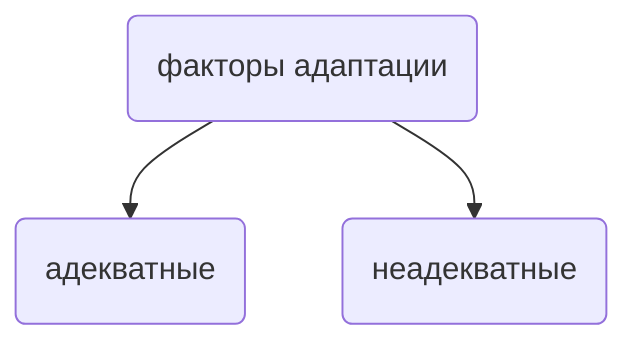
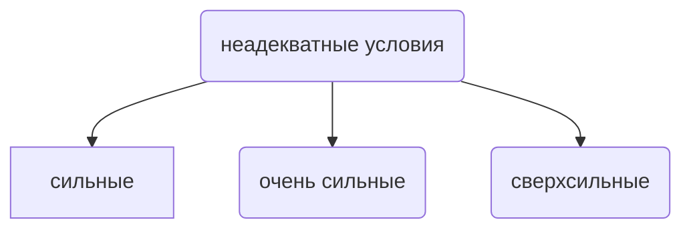
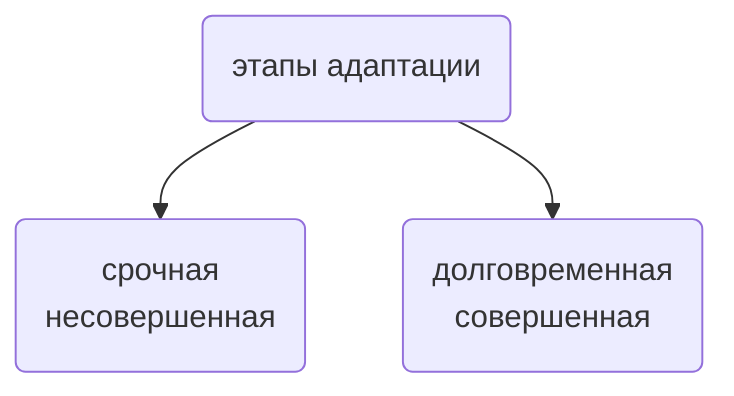
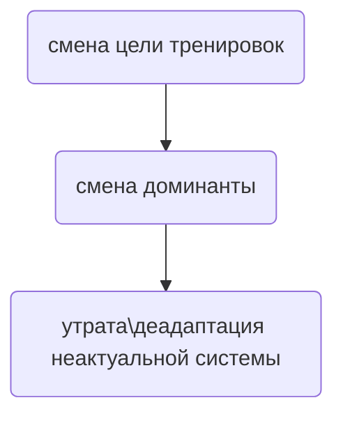

# Адаптация

> ...и кто среди людей хочет остаться чистым, должен уметь мыться и грязной водой.
>
> – *Ницше*

Об адаптации написано немало книг. Есть целая научная дисциплина, занимающаяся вопросами адаптации - **адаптология**.
Мы опустим определение адаптации, поскольку смысл этого слова понятен для большинства людей.

Особенно ценно это слово в контексте тренировок. Ведь что, если не адаптация, является
целью и квинтэссенцией тренировочного процесса? Написанное здесь едва ли может удивить человека, потому что
так или иначе человек сталкивается с явлениями адаптации. Но достанет ли неподготовленному
человеку знаний облачить то, что он мыслит
об адаптации в словесную, логическую и структурированную форму? Едва ли. Поэтому, когда Вы прочитаете какой-нибудь факт
об адаптации и скажите: "нееет... ну это и так понятно" - спросите себя, смогли бы Вы выразить словами 
явление, о котором прочли?

<!--:::info ИНФОБЛОК
:nerd_face:

:timer_clock:
:::-->

<!--:::info ИНФОБЛОК
:nerd_face:

:timer_clock:
:::-->

## Человек и лазание

> Мне кажется, это естественное увлечение для людей. Я еще с детства хотел им заниматься.
> Естественные скалы - это единение природы и человека, новые ощущения.
>
> – Алексей Рубцов

Что за прекрасные слова. До слёз. Основной смысл цитаты состоит в том, что "естественное для людей". Очевидно, что
Алексей в большей степени вкладывал в эти слова что-то метафизическое и эфимерное. Но что насчёт научного подхода?

Насколько же лазание являетсва естественным процессом для человеческого тела? Настолько, насколько
естественно прямохождение для обезьян.

Поскольлу человек раньше начал лазать по деревьям, чем по скалам, поговорим сначала о лазании по деревьям.
В таком виде лазания важно, чтобы голеностопный сустав имел значительный угол сгибания. Угол сгибания
позволяет приблизить центр масс ближе к дереву.

В Филлипинах живут коренные охотники-собиратели Тва, которые лазают по деревьям с самого детства. Если измерить угол,
на который может сгибаться их голеностопный сустав и сравнить его с обезьянами и обычными людьми, то получится
диаграмма следующего вида:

В самом низу мы видим обычных людей, а собиратели из Филлипин занимают второе место, приближаясь
к обезьянам. Говорит ли это о том, что человек может повторить за обезьяной, практикуясь
с самого детства? - да. Но насколько это естественно для него?

У обезьян есть анатомическое преимущество, позволяющие им сгибать стопу в плюсне.
Добавить к этому ещё и возможность противопостовлять большой
палец, что позволяет использовать нижние конечности как верхние. На этом фоне строение стопы человека выглядит
не самой удачной для лазания инженерной конструкцией. Относительная малоподвижность человеческой стопы
больше подходит для ходьбы и бега.
Кроме того, большеберцовая кость обезьян предполагает бОльшую подвижность априори, в то время как человек
может добиться необходимой подвижности только за счёт активации смежных структур.

В пользу того, что человек не имеет анатомических предрасположенностей к лазанию говорит и то, что
плечевые кости обезьян плотнее, чем человеческие, что даёт премущество для виса на руках.

Да, мы можем повторить за обезьянами. Но то, что займёт у нас время на адаптацию, для обезьян привычное дело без
каких-либо тренировок. Человек давно отошёл от лазания и занялся прямохождением, о чём и говорит его скелет, а лазание
осталось в далёком прошлом.

Вернёмся к началу: лазание настолько же естественно для человека, как и прямохождение для обезьян. Да, животные
способны адаптироваться к непривычным условиям, но это лежит за пределами их анатомической предрасположенности,
поэтому с научной точки зрения можно сказать, что **лазание не является естественным для человека способом передвижения**, как и
прямохождение для обезьян.

## Адаптология

### Факторы адаптации

Факторы адаптации можно разделить на две группы, согласно их адекватности:

и вот Вам вопрос: **предоставляет ли скалолазание адекватные условия для адаптации человека?**
Вы только вдумайтесь: животное, для которого лазание по деревьям требует перестроек и адаптации, пытается 
взобраться по небольшим выстуам скал. Это абсурд. Не смешите горных козлов, кожаные мешки!

> Скальные туфли сковывали его стопы. 
> Он хотел бы избавиться от них, 
> А ведь без них он не может поставить ногу на крошечные выступы. 
> Его руки потели и скользили, 
> поэтому он мог лезть только с мешочком магнезии. 
> А ведь цель была так близко. 
> Старики говорят, что мы, 
> спартанцы, потомки самого Геракла... 

Ничто в человеке не выдаёт исключительную способность в том, чтобы лазать по небольшим выступам скал.

Что же вы, люди, такое делаете со своим немощным телом? Неужели хотите уподобиться рыбам,
выброшенным на сушу, или любой другой твари, попавшей в неадекватные для своего тела условия?

"Автор хочет сказать, что человек идёт против своей собственной природы?". Напротив.
Умом и упорством человек демонстрирует, что у него масса **дополнительных механизмов приспособления**.
Даже несмотря на то, что **в окружающей среде большинство факторов являются неадекватными** и противоречат текущим
свойствам его организма.

Выделяют три групы неадекватных факторов адаптации по уравню их воздействия на субъект:

Цель адаптации состоит в том, чтобы работать с сильными и очень сильными неадекватными факторами, избегая
сверхсильных, потому как последние приводят к патологии.

:::note ЗАМЕТКА
Куда бы Вы ни шли - Вы идёте в ногу с природой. Противоречия лишь её часть.
:::

### Адаптация - функция времени

Адаптация - функция времени. Другими словами, адаптация определяется временем.
На отрезке этого времени можно отследить различные фазы, стадии и этапы.

В общем случае адаптацию можно разделить на два этапа:

Положим, что среднестатистический офисный работник впервые придя на скалодром,
пытается пролезть триклятый траверс сквозь весь зал. Мы видим, как его немощное
тело пытается **срочно** адаптироваться к новым условиям:

- легочная вентиляция &#8593
- минутный объём кровообращения &#8593

Его тело полностью мобилизовало все имеющиеся ресурсы. Неужели он доберётся до
финиша? Неужели кровь, что стремительно движется по его сосудам, приносит полезное
и уносит всё пагубное? Офисный работник жадно захватывает воздух... но всё тщетно...
обессилев, он падает на маты после трёх-четырёх перехватов. Кто-то из зрителей
безмолвно опускает голову, кто-то плачет, а кто-то даже упал на колени, вскидывая
голову вверх, разводя руки в стороны. Зрители не могут поверить в увиденное. Или нет?

Мы все знали, что у него не было и шанса пролезть весь зал. Да, он мобилизовал весь
совй **функциональный ресурс**, но достаточно ли его? (нет).

*"Основное содержание срочного этапа адаптации заключается в мобилизации энергетических и
структурных ресурсов организма и дискриминативном их распределении в целях формирования
функциональной системы, эффективно реагирующей 
на действие неадекватного фактора среды и обеспечивающей специфическую (долговременную) адаптацию к нему. И то,
и другое достигается посредством активации механизмов не­специфического приспособления — стресса."*

Итак, срочная адаптация, выраженная стрессом, положит начало для формирования долгосрочной адаптации,
куда более совершенной.

:::note Заметка
Долговременный этап адаптации развивается постепенно,
в результате длительного или многократного действия на организм фактора среды.
**Стресс. Таков Путь.**
:::

### Адаптационный след и принцип доминанты

> Не идите по следам древних, но ищите то, что искали они
>
> - Мацу Басё

Фактор, действующий на Вас во время тренировок, обращется внутрь Вас. В самую суть, в ядро клеток.
В ядре находится генетический код, в нём есть ответ на главный вопрос: "Как и чем ответить на стрессовый фактор".
Ответ часто носит уникальный, избирательный характер. Увеличивается функциональность только тех структур, которые необходимы.
Так формируется **системный структурный след**. Таким образом, тренировочным процессом Вы оставляете следы, которые
формируют и укрепляют долгосрочную адаптацию.

**Принцип доминанты** подразумевает, что активируется необходимая для конкретной адаптации система. Прочие системы
напротив, подвергаются **деадаптации**. Поэтому вместе с тем, как меняются цели и задачи тренировки, меняется и сам организм.
Ненужные системы атрофируются, нужные набирают обороты. **Нужна сверхсила - отключается сверхвыносливость** и наоборот.
Это проистекает из явления, называемого **смена доминант**

Схема того, каким образом "заметаются следы":

## Итог

- человеческое тело не самый удачный скин для лазания. Лазание представляет для него большое количество
неадекватных факторов адаптации.

- тренировки - это не что иное, как целенаправленное воздействия на организм по большей части
неадекватных факторов адаптации.

- срочная адаптация, возникающая как реакция на стресс, оставляет следы и со временем перерастает в специфическую, долгосрочную
адаптацию, которая более совершенна.

- адаптация действуют по принципу доминанты, предполагающий переключение с одного механизма на другой, с "забыванием" первого.

### Приложение знаний

Понимание того, что лазание далеко не естественный процесс для человека, приводит к выводу:
**нужны адаптационные перестройки**, которые могут затягиваться во времени, - не спешите с этим.
Принцип доминант накладывает ограничения на возможность для **человека овладеть несколькими
механизмами адаптации** на предельном уровне. Расставляйте приоритеты.

### Вопросы для самоконтроля

 
  

		Есть ли основания утверждать, что тело человека создано для лазания?
	

	  Нет

 
  

		На какие два этапа можно разделить процесс адаптации?
	

	  Срочная (неспецифическая) адаптация и долговременная (специфическая) адаптация

 
  

		Человек в бОльшей степени сталкивается с адекватными или неадекватными факторами
		адаптации?
	

	  Неадекватными факторами

 
  

		Реально ли стать Олимпийским Чемпионом по спортивному лазанию и плаванию в один год? Обоснуйте.
	

	  Вероятность такого события крайне мала. Спорт высших достижений подразумивает предельные адаптационные
		возможности, а значит, если усиленно развивать навыки лазания, то согласно принципу доминанты,
		начнётся процес деатаптации структур, ответственных за плавание и наоборот.

## Дополнительно

### Эффект низкой базы

Положим, что новичок решил увеличить подтягивание с дополнительным весом с 1 кг до 10 кг.
Проходит месяц другой и о чудо: он подтянулся с отягощением 10 кг. Другими словами, он преумножил свой
результат десятикратно.

Параллельно с этим свой результат решил увеличить и МСМК с 85 кг. Стоит ли этому спортсмену ожидать
такого же прироста в силовых показателях, т.е. до 850 кг? Конечно, нет. **Новичок продемонстрировал
эффект низкой базы**, который предполагает колоссальный в процентном соотношении прирост показателей 
в сравнении с опытным спортсменом, чьи адаптационные возможности уже достигают лимита.

Если Вы новичок, то знайте, прогресс будет быстрым и впечатляющим. Это хорошая мотивация:
видеть свои молниеносно растущие силовые показатели. В то же время, если Вы опытный спортсмен, то
не забывайте: медленно растущие результаты - признак того, что Вы приближаетесь к пределам Вашего организма
и совершенству.

