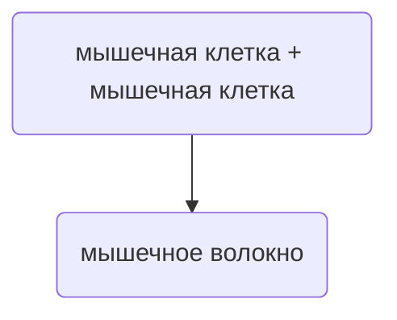
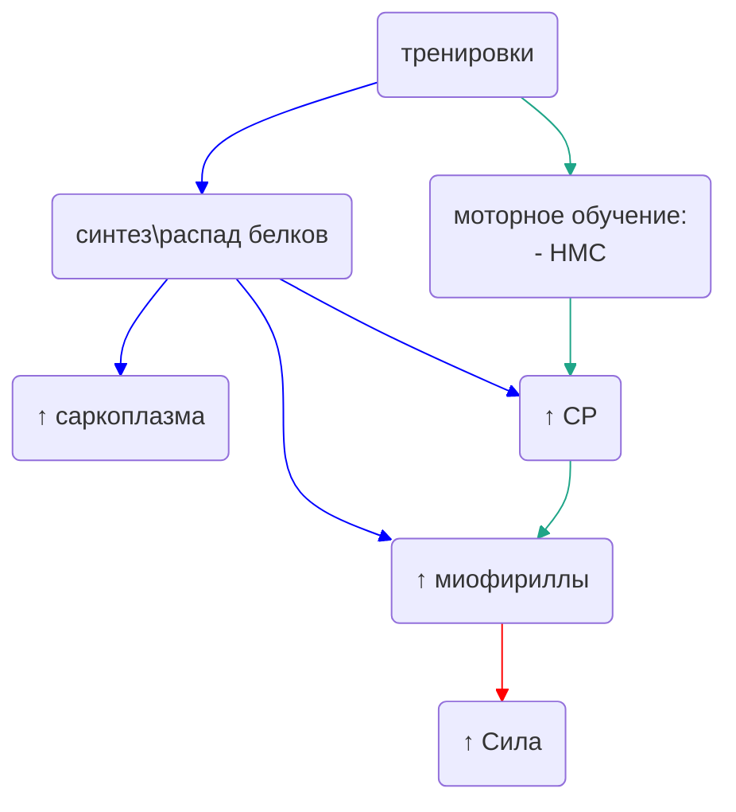

# Мышцы

Мышцы - движущая сила человеческого тела. Всё благодаря "суперспособности" мышечной ткани - **сокращение**.
Сокращаясь, мышцы тянут за собой кости, что и создаёт движение.

Часто мышцы можно считать показателем адаптированности человека к какой-либо деятельности.
У одного развиты руки, у другого ноги и т.д.

Тренировки **изменяют** мышцу и её способности. Скорость этих изменений будет определяться
**задатками**, а значит процесс и результат таких изменений будут уникальными для каждого человека.
Однако русло, в котором происходят эти изменения, можно обобщить на всех людей.

Знания о том, как мышцы адаптируются к тренировкам, 
позволяют сформировать правильную тренировочную программу.

:::note ЗАМЕТКА!
Мышца - это **орган**, который включает в себя кроме мышечной ткани, соеденительную и
эпителиальную ткани.
В этой статье имеется в виду исключительно **скелетная** мышечная ткань.
:::

## Строение мышцы

### Общая структура

Перед Вами качан капусты романеско. Обратите внимание на то, как устроена форма качана, от которого ответвляются
другие такие же качаны, от которых ответвляются другие такие же качаны, от которых ответвляются... достаточно?

Это пример устройства объекта, обладающего свойством **самоподобия**, т.е. целое имеет такую же форму, что одна и более частей.

Но оставим капусту и перейдём к мышце:

А это кабель:

Если биологические ткани сотканы из клеток, то и в мышечной ткани должны быть клетки, верно?
Предлагаю Вам самостоятельно отыскать, **где на картинке с изображением мышечной структуры
находится клетка (CELL)**.

Клетки, покрытые **внутренней оболочкой (эндомизий)**, они же волокна (**FIBRE**), упаковываются в пучки.
Эти пучки, покрытые **средней оболочкой (перемизий)**, в свою очередь составляют само тело мышцы.
А тело мышцы покрыто **внешней оболочкой (эпимизий)**. 

Все эти оболочки принадлежат к другому (не мышечной) типу ткани. Кроме того, мышца пронизана
сосудами и нервами, которые тоже есть на рисунке.

:::note ЗАМЕТКА!
Оболочки имеют свои названия. Чтобы проще их запомнить, необходимо
понимать их перевод, поскольку названия в биологии часто
**самоописательны**.
- Эндо- (внутренний)
- Пере- (вокруг, между)
- Эпи- (внешний, на)

**сарко-** (греч.) **миз-** (греч.) и **мио-** (лат.) обозначают одно и то же: мышцу.

Пример: эндо + мизий = внутри мышцы
:::

:::tip СОВЕТ!
Попробуйте нарисовать по памяти похожую схему, начиная с мышечной клетки и заканчивая
телом мышцы.
:::

### Мышечное волокно

Мышечные клетки - особенные клетки. Настолько, что цитологи создали для них определённую номенклатуру.
Например, то, что в обычной клетке называют цитоплазмой, в мышечной клетке называют **саркоплазмой**. То, что
в обычной клетке называют мембраной, в мышечной называют **сарколеммой** и т.д.

Дело в том, что мембрана мышечной клетки на определённом этапе
развития сливается с мембраной другой мышечной клетки.
Вместе с этим сливается и всё их содержимое, становясь как бы одним целым.
Такая структура называется **миосимпласт**. Миосимпласт складывается в **мышечное волокно - структурную единицу мышечной ткани**.

Давайте посмотрим на такое мышечное волокно:

в ценре мышечного волокна мы снова видим (самоподобие) волокнообразные структуры - **миофибриллы**.
Именно они отвечают за "суперспособность" мышечной ткани. Миофибриллы окружены **саркоплазматическим ретикулом**
и всё это находится в жидкой части: вышеупомянутой саркоплазме.

### Поперечное сечение

Несмотря на то, что все скелетные мышцы выполняют одну функцию, они могут иметь
принципиально разную **архитектуру**. 

На рисунке ниже мышцы, имеющие различную ориентацию мышечных волокон:

Первая мышца (слева) имеет параллельный ход волокон, которые в конце с каждой стороны сходятся в одну точку,
образуя **веретенообразную** форму - это **веретенообразные** мышцы.

Крайняя мышца, волокна которой крепятся к центральному сухожилию, образуя вид пера, - это **перистые** мышцы.
Линия, которая проходит по центру мышцы от одного крепления до другого, называется **длинником мышцы**.

Если разрезать мышцу поперёк длинника мышцы, тогда мы получим **анатомическое попречное сечение**.
Но вот в чём дело. Разрезав перистую и веретенообразную мышцы одинакового объёма, мы увидим,
что количество волокон в таком сечение будет различным:

в перистой (на рисунке справа) будет значительно больше мышечных волокон. Т.е. при равных объёмах,
**перистая мышца имеет большее количество мышечных волокон**. А мы знаем, что если много
мышечных волокон, то много и миофибрилл, а значит можем предположить: **перистые мышцы способны развивать большее усилие**.

И это действительно так, перистая мышца может быть сильнее, чем веретенообразная в 10 раз.

Искушённый читатель спросит: **"А почему не все мышцы в теле человека перистые, если они такие сильные?"**.
Что ж, этому есть объяснение.

Перистые мышцы не способны к значительному укорачиванию:

когда мышечные волокная укорачиваются, они сдвигают сухожилия
(под буквой m на рисунке) на небольшую величину. Это накладывает ограничение
на амплитуду движения. Поэтому перистые мышцы встречаются там, где нужно
создать большое усилие с малой амплитудой движения.

Веретенообразные мышцы же, сокращаясь, могут изменять свою длину в значительной степени.
А это значит, что амплитуда целевого движения может быть больше, чем у перистой.

:::note ЗАМЕТКА!
Трёхглавая мышца голени, которая сгибает стопу, хороший пример перистости.
Эта мышца способна развить усилие в 8000 Н. Это одна из так называемых
**антигравитационных мышц**, которым необходим высокий уровень силы. 
:::

:::tip СОВЕТ!
Хороший способ узнать, являтеся ли мышца перистой (кроме гугла) -
попытаться её сократить. Если мышца **не увиличилась в объёме**, значит
она перистая (но лучше загуглить).
:::

## Сила

Главный постулат мышечной силы гласит, что **сила мышцы возрастает прямопропорционально 
её поперечному сечению, при прочих равных**. Но прочие, как это обычно бывает, не равны (об этом позже).

Если разрезать веретенообразную мышцу поперёк, то мы можем положить, что площадь такого сечения **S**
будет равна произведению площади мышечного волокна **Sмв** на количество волокон **n**.

**S = Sмв * n**

Это значит, что увеличить площадь поперечного сечения можно двумя способами:

- увеличив размер мышечных волокон Sмв (**гипертрофия**)
- увеличив количество мышечных волокон n (**гиперплазия**)

На количество мышечных волокон повлиять мы главным образом никак не можем:
согласно большинству исследований, **количество мышечных волокон закладывается с раннего возраста**.
Какие-то люди (часто это мезоморфы) обладают бОльшим количеством мышечных волокон, чем другие.
Иногда это даже кратное преимущество.

А вот размер мышечного волокна хорошо поддаётся увеличению. Но надо ли оно нам?

:::note ЗАМЕТКА!
В действительности мышечные волокна способны увеличить своё количество. Но вклад этого
процесса в тренировках незначителен.
:::

### Гипотезы силы

Положим три гипотезы:
- увеличение размера мышцы прямопропорционально увеличивает силу (А)
- сила увеличивается быстрее, чем размер мышцы (В)
- размер увеличивается быстрее, чем сила (С)

Самая наивная гипотеза под буквой А предполагает, что если мышца увеличилась на 1 единицу, то и сила
увеличится на 1 единицу. Но такая гипотеза находит своё подтверждение в небольшом количестве исследований.

Связь между размером и силой мышцы чаще носит **нелинейный** характер, что отсылает нас главным образом
к гипотезе В и С. Другими словами, нельзя найти однозначную связь между размером и силой мышцы.
Такая диссоциация объясняется большим количеством причин (тех самых "неравных").

### Гипертрофия

В основе гипертрофии лежит распад и синтез функциональных и структурных элементов, в частности белков.
Миофибриллы (которые, как мы уже знаем, являются **сократительным аппаратом**) 
в конечном итоге будут определять силу, которую способна развить мышца (чем их больше, тем сильнее мышца).

В зависимости от тренировок, гипертрофия может происходить по различным сценариям. Адептов Пути Bakufu
главным образом интересует **мощность и взрывная сила**. Такая гипертрофия провоцируется высокой интенсивностью при малых
количествах повторений, поскольку установлено, что **сила не зависит от объёма упражнений**.

Конечно, для нас лучше, если сила будет увеличиваться без гипертрофии, ведь мышечная ткань **достаточно тяжёлая**.
Да, увеличивая мышечную ткань, мы можем выиграть в **абсолютной силе**, но проиграем в **относительной**.
Полностью избежать гипертрофии невозможно. Однако мы можем стремиться к тому, чтобы сила увеличивалась
быстрее, чем размер мышцы.

:::tip СОВЕТ!
Избегайте многоповторных упражнений с весами (силовых гипертрофических трениовок),
поскольку это приводит к гипертрофии
мышечной ткани по типу "C", что плохо отразится на лазании.
:::

### Нервная адаптация

Сокращение мышцы подчиняется нервной системе. Адаптация нервно-мышечных связей (НМС) является одним из объяснений диссоциации между
размером мышцы и её силой. НМС не увеличивает размер мышцы сама по себе и при этом способна задействовать больше функциональных
единиц, что повлечёт за собой увеличение силы без изменения размера мышцы.
НМС является лишь частью моторного обучения и так же как гипертрофия определяется
тренировочным протоколом.

### Два пути

синий цвет - путь гипертрофии, красный - путь силы и зелёный - путь нервной системы

Можно сказать, что тренировки приводят к двум эффектам:

**распад и образование белокв**
- увеличение мембраны клеток
- увеличение саркоплазматического ретикулума(СР) (участвует в сократительной деятельности)
- увеличение количества миофибрилл

**моторное обучение**
- эффекнивная активация СР
- ретикулум эффективнее действует

Как Вы считаете, какие **два пути** лучше всего подойдут для истинного Bakufu?
Мы ищем силы, а не гипертрофии, поэтому лучше, если тренировочный протокол будет направлен
на увеличение количества миофибрилл и развитие нервной системы.

## Итог

- мышцы - источник движения
- мышечное волокно - структурная единица мышцы, имеющая в своём составе миофибриллы, которые
являются **сократительным аппаратом**. Чем больше мышечных волокон, а значит и миофибрилл, тем сильнее мышца
- мышцы могут иметь принципиально разную архитектуру в пределах одного организма
- гипертрофия может иметь разное качество. Размер и сила мышцы имеют сложную, нелинейную зависимость.
- тренировочный протокол определяет, каким будет размер и сила мышцы.
- вклад в силу вносят и прочие факторы, кроме размера мышцы, например, адаптация нервной системы

### Приложение знаний

Мышца способна адаптироваться к различным целям и задачам. Для развития силы необходимо
выбирать правильный протокол, сочитающий в себе умеренную гипертрофию мышечной ткани с
акцентом на адаптацию нервной системы, например, протоколы, содержащие высокоинтенсивные, малообъёмные
тренировки.

### Вопросы для самоконтроля

 
  

		Что является структурной единицей мышцы?
	

	Мышечное волокно

 
  

		Как увеличить количество мышечных волокон?
	

	Как правило, количество мышечных волокон **фиксировано** с раннего возраста.

 
  

		Возможно ли увеличение силы без изменения размера мышцы?
	

		Да. В силу мышцы вносит вклад не только её размер, но и другие факторы, действие
		которых способно сказаться на силе. Например адаптация нервно-мышечной связи.

 
  

		Как Вы понимаете диссоциацию показателей размера и силы мышцы?
	

		Вопреки распространённому мнению о том, что сила возрастает пропорционально размеру мышцы,
		исследования показывают неленейный характер связи между силой и размером.

 
  

		Назовите два типа мышц согласно ориентации их волокон
	

		Перистые и веретенообразные.

 
  

		Какая мышца является недостижимым идеалом для истинного Bakufu?
	

		Мышца, которая увеличивает свою силу **без гипертрофии**. Таким образом
		возрастает относительная сила и абсолютная сила.

 
  

		Какой протокол тренировки лучше подбирать для развития силовых качеств?
	

		Протоколы с небольшим количеством повторений, при высокой интенсивности каждого повторения.
		Например, работа с максимальными или околомаксимальными весами.

