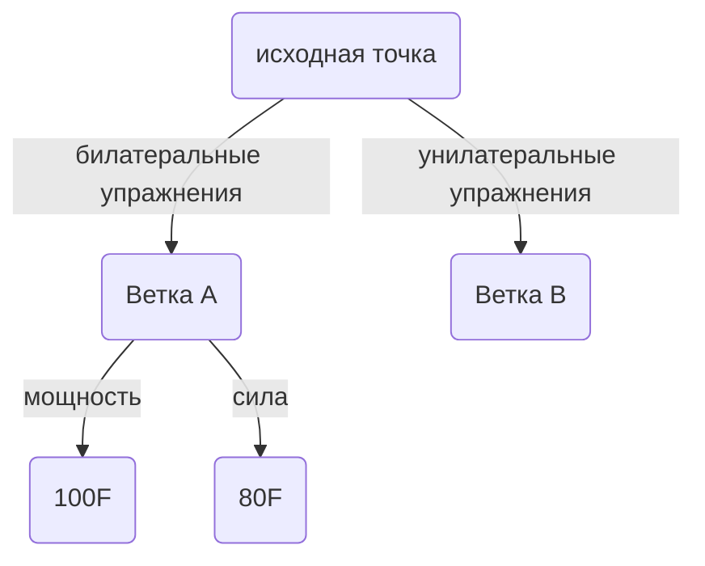
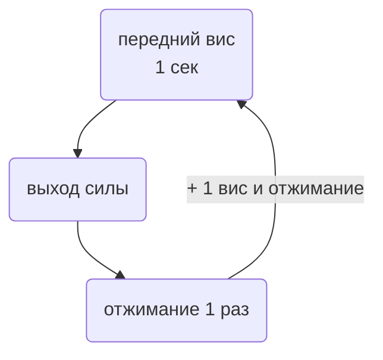

# ОФП

## Необходимые навыки

- стойка на руках (20 сек)
- подтягивание на одной руке (1 раз на любой руке)
- передний вис (5 сек)
- выход силой на две (5 раз)
- подтягивание с дополнительным отягощением на одно повторение (65%)

## Цели

- отжимания в стойке на руках (2 раза)
- увеличение количества подтягиваний на одной руке (2 раза на любой руке)
- увеличение дополнительного отягощения на одно повторение (75%)
- подтягивание в переднем висе (1 раз)

## Словарь упражнений

- Австралийские подтягивания

- Толчок банда

- Негативное подтягивание

- L-отжимания

- Лодочка

- Ролик

- Мостик по стенке

- Отжимания на перекладине

- RM

- печатная машинка

## Стратегия

1. Выбор ветки (одна ветка в течение одной недели).

2. Последовательное выполнение заданий из ветки.

## Ветка А

### 100F

#### Разминка (RAMP метод)

**Фаза "Raise"**

- Ходьба, простая суставная разминка
- Приседания на шведской стенке
	- 20 раз
	- 3 подхода
	- отдых 1 минута

**Фаза "Activate and Mobilize"**

- Австралийские подтягивания
	- 10 раз
	- 3 подхода
	- отдых 1 минута
- Подтягивания с фиксацией (2 сек) над перекладиной
	- 3 раза
- Толчок банда (любая упругость)
	- 10 раз
- Отжимания от перекладины
	- 6 раз

**Фаза "PAP"**

- Подтягивания 5RM (посмотреть в таблице)
	- 1 подход
- Отжимания на перекладине c 10 кг
	- 5 раз
- Подтягивания 1RM
	- 1 подход

:::note ОТДЫХ
Отдых между каждым упражнением или подходом 3-5 минут
:::

#### Выход силы

- Выходы силы
	- 4 раза
	- 2 подхода

- Выходы силы с 5кг
	- 1 раз

- Взрывные подтягивания с выбросом руки вверх
	- чередование рук каждый раз
	- 4 раза
	- 2 подхода

### 80F

#### Разминка (RAMP метод)

**Фаза "Raise"**

- Ходьба, простая суставная разминка
- Приседания на шведской стенке
	- 20 раз
	- 3 подхода
	- отдых 1 минута

**Фаза "Activate and Mobilize"**

- Австралийские подтягивания
	- 10 раз
	- 3 подхода
	- отдых 1 минута
- Подтягивания с фиксацией  над перекладиной
	- 3 раза
	- фиксация 2 сек
- Толчок банда 
	- 10 раз
	- любая упругость банда

#### Подтягивания

- 5RM
	- 3 подхода

- 10RM
	- 1 подход

- Негативное подтягивание с отягощением 
	- максимально долго
	- 1 раз
	- 2 подхода
	- 75% от веса тела

:::note ЗАМЕТКА!
Как долго длилось негативное подтягивание? Сделай заметку!
:::

## Ветка В

#### Разминка

**Фаза "Raise"**

- Ходьба, простая суставная разминка
- Приседания на шведской стенке
	- 20 раз
	- 3 подхода
	- отдых 1 минута

**Фаза "Activate and Mobilize"**

- Австралийские подтягивания одной рукой
	- 6 раз
	- 4 подхода
	- отдых 1 минута
- Толчок банда 
	- 10 раз
	- любая упругость банда
- Печатная машинка с фиксацией 
	- 6 смещений
	- фиксация 5 сек

#### Подтягивания на одной руке

- Подтягивания на перекладине
	- 4 раза в сумме двух рук
	- прямой хват

- Подтягивания на кольце
	- 2 раза в сумме двух рук
	- прямой хват в нижней фазе и обратный в верхней

- Негативное подтягивание
	- 10 кг
	- максимально долго

## Антагонисты

#### Отжимания

- Негативное отжимание в стойке на руках
	- максимально долго
- L-отжимания
	- 5 раз
	- 3 подхода
- Отжимания на брусьях
	- 8 раз
	- 3 подхода

:::note ЗАМЕТКА!
С какого угла можешь разогнуть руки в стойук на руках?
Сделай заметку!
:::

#### Передний вис

- подтягивание в переднем висе (одна нога согнута в колене)
	- 2 раза
	- 1 подход

#### Связка

**На кольцах до отказа:**

:::note ЗАМЕТКА!
Сколько кругов? Сделай заметку!
:::

#### Прочее

- лодочка с паузой
	- 15 сек 
	- отдых 15 сек
	- 3 подхода
- ролик
	- 5 раз
	- 3 подхода
- мостик по стене
	- 2 попытки

:::note ЗАМЕТКА!
Сколько сделали шагов по стене? Запомните!
:::
