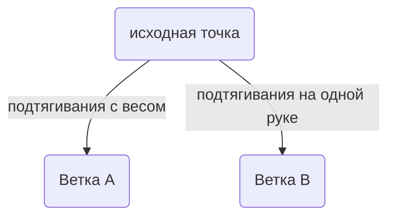
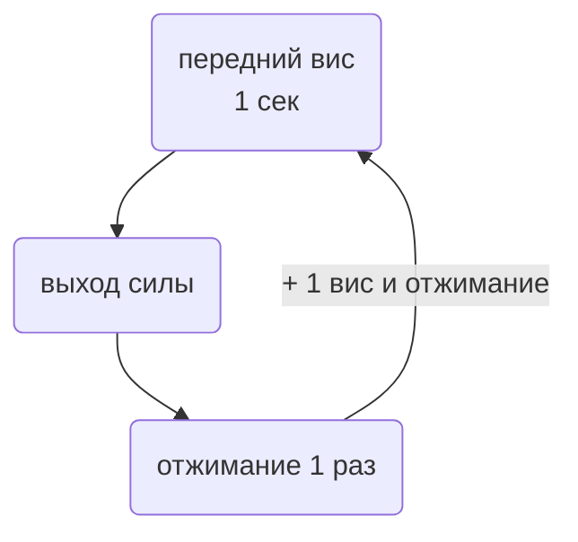

# ОФП

## Необходимые навыки

- стойка на руках (20 сек)
- подтягивание на одной руке (1 раз на любой руке)
- передний вис (5 сек)
- выход силой на две (5 раз)
- подтягивание с дополнительным отягощением на одно повторение (65%)

## Цели

- отжимания в стойке на руках (2 раза)
- увеличение количества подтягиваний на одной руке (2 раза на любой руке)
- увеличение дополнительного отягощения на одно повторение (75%)
- подтягивание в переднем висе (1 раз)

## Словарь упражнений

- Австралийские подтягивания

- Толчок банда

- Негативное подтягивание

- L-отжимания

- Лодочка

- Ролик

- Мостик по стенке

## Стратегия

1. Выбор ветки.

2. Последовательное выполнение заданий из ветки.
## Ветка А

### Разминка (RAMP метод)

#### Фаза "поднятия"

- Ходьба, простая суставная разминка
- Приседания на шведской стенке
	- 20 раз
	- 3 подхода
	- отдых 1 минута

#### Фаза "активации и мобилизации"

- Австралийские подтягивания
	- 10 раз
	- 3 подхода
	- отдых 1 минута
- Подтягивания с фиксацией (2 сек) над перекладиной
	- 3 раза
- Толчок банда (любая упругость)
	- 10 раз

:::note ОТДЫХ
Отдых между каждым упражнением или подходом 3-5 минут
:::

### Подтягивания

- Подтягивания с отягощением 50%
	- 2 раза
- Подтягивания с отягощением 60%
	- 1 раз
- Подтягивания с отягощением 65%
	- 1 раз
- Негативное подтягивание с отягощением 75%
	- максимально долго
	- 1 раз
	- 2 подхода

:::note ЗАМЕТКА!
Как долго длилось негативное подтягивание? Сделай заметку!
:::

### Отжимания

- Негативное отжимание в стойке на руках
	- максимально долго
- L-отжимания
	- 5 раз
	- 3 подхода
- Отжимания на брусьях
	- 8 раз
	- 3 подхода

:::note ЗАМЕТКА!
С какого угла можешь разогнуть руки в стойук на руках?
Сделай заметку!
:::

### Передний вис

- подтягивание в переднем висе (одна нога согнута в колене)
	- 2 раза
	- 1 подход

### Связка

**На кольцах до отказа:**

:::note ЗАМЕТКА!
Сколько кругов? Сделай заметку!
:::

### Заминка

- лодочка с паузой
	- 15 сек 
	- отдых 15 сек
	- 3 подхода
- ролик
	- 5 раз
	- 3 подхода
- мостик по стене
	- 2 попытки

:::note ЗАМЕТКА!
Сколько сделали шагов по стене? Запомните!
:::
